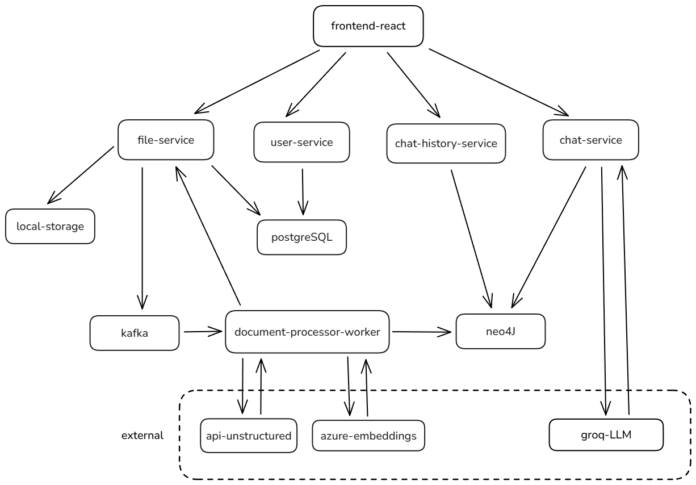

# DrChat

Chatbot médico que procesa documentos PDF y permite a los usuarios interactuar con un sistema de preguntas y respuestas basado en la información contenida en dichos documentos.

Los archivos PDF pueden ser enviados por los usuarios a través del frontend. Los nodos generados incluirán un `session_id` para asociar el documento a un chat específico. El sistema procesa los documentos, extrae entidades y relaciones, y permite a los usuarios realizar consultas sobre la información contenida en ellos.

---

## 📋 Prerrequisitos

- **Docker** y **Docker Compose** instalados
- **Make** (opcional, para usar comandos simplificados)
- Claves de API configuradas para:
  - Azure OpenAI (embeddings)
  - Unstructured API (procesamiento de PDFs)

---

## 🚀 Guía de inicio rápido

### 1. Clonar el repositorio
```bash
git clone <repository-url>
cd DrChat
```

### 2. Configurar variables de entorno
```bash
# Copiar archivos de configuración
cp .env.example .env
cp backend/ingestion/file-service/.env.example backend/ingestion/file-service/.env
cp backend/pipeline/document-processor-worker/.env.example backend/pipeline/document-processor-worker/.env
cp backend/user/chat-service/.env.example backend/user/chat-service/.env

# Editar los archivos .env con tus configuraciones específicas
```

### 3. Levantar el proyecto

#### Usando Makefile (recomendado):
```bash
# Ver todos los comandos disponibles
make help

# Levantar proyecto completo con bases de datos locales
make up

# Levantar con Neo4j externo (configurar NEO4J_URI en .env)
make up-external-neo4j

# Levantar con MongoDB externo (configurar MONGODB_URI en .env)  
make up-external-mongo

# Levantar con ambas bases de datos externas
make up-external

# Ver estado de contenedores
make status

# Ver logs de servicios principales
make logs

# Detener proyecto
make down
```

### 4. Acceso a los servicios

Una vez que los servicios estén ejecutándose:

| Servicio | URL | Descripción |
|----------|-----|-------------|
| **Frontend** | http://localhost:3000 | Interfaz web de DrChat |
| **File Service** | http://localhost:8001/docs | API de gestión de archivos (Swagger) |
| **File Service Health Check** | http://localhost:8001/ | Estado del file-service |
| **Chat Service** | http://localhost:8002/docs | API de chat (Swagger) |
| **Chat History Service** | http://localhost:8003/docs | API de historial de chat (Swagger) |
| **User Service** | http://localhost:8004/docs | API de usuarios (Swagger) |
| **Neo4j Browser** | http://localhost:7474 | Interfaz web de Neo4j (usuario: neo4j, contraseña: password) |
| **MongoDB** | localhost:27017 | Base de datos (acceso directo) |
| **Kafka** | localhost:9092 | Broker de mensajes |

---

### **📋 Variables Generales (`.env`)**

| Variable                    | Descripción                                                                 |
|-----------------------------|-----------------------------------------------------------------------------|
| `MONGODB_URL`               | URL de conexión para MongoDB (ej: `mongodb://mongodb:27017/drchat`).        |
| `MONGODB_DATABASE_NAME`     | Nombre de la base de datos MongoDB (ej: `drchat`).                          |
| `NEO4J_URI`                 | URI de conexión para la base de datos Neo4j.                                |
| `NEO4J_USERNAME`            | Usuario para autenticación en Neo4j.                                        |
| `NEO4J_PASSWORD`            | Contraseña para autenticación en Neo4j.                                     |
| `KAFKA_BOOTSTRAP_SERVERS`   | Servidores de Kafka (ej: `kafka:29092`).                                   |
| `KAFKA_FILE_UPLOAD_TOPIC`   | Tópico de Kafka para eventos de archivos (ej: `file-upload-events`).       |
| `KAFKA_GROUP_ID`            | ID del grupo de consumidores Kafka (ej: `document-processor-group`).       |
| `FILE_SERVICE_URL`          | URL del servicio de archivos (ej: `http://file-service:8000`).              |

### **📄 Variables por Servicio**

#### **File Service** (`backend/ingestion/file-service/.env`)
| Variable      | Descripción                                                                 |
|---------------|-----------------------------------------------------------------------------|
| `STORAGE_DIR` | Directorio donde se almacenan los archivos subidos (ej: `/app/storage`).    |
| `LOG_LEVEL`   | Nivel de logging para los servicios (ej: `INFO`, `DEBUG`, `ERROR`).         |

#### **Document Processor Worker** (`backend/pipeline/document-processor-worker/.env`)
| Variable                      | Descripción                                                     |
|-------------------------------|-----------------------------------------------------------------|
| `UNSTRUCTURED_API_KEY`        | API Key para el servicio Unstructured (procesamiento de PDFs). |
| `UNSTRUCTURED_URL`            | URL del servicio Unstructured.                                 |
| `AZURE_OPENAI_API_KEY`        | API Key para Azure OpenAI (embeddings).                        |
| `AZURE_OPENAI_ENDPOINT`       | Endpoint de Azure OpenAI.                                      |
| `AZURE_OPENAI_EMBEDDINGS_MODEL` | Modelo de embeddings de Azure OpenAI.                       |
| `NEO4J_DATABASE`              | Nombre de la base de datos Neo4j para documentos (ej: `documents`). |
| `VECTOR_INDEX_NAME`           | Nombre del índice vectorial en Neo4j.                          |
| `FULLTEXT_INDEX_NAME`         | Nombre del índice de texto completo en Neo4j.                  |

#### **Chat History Service** (`backend/user/chat-history-service/.env`)
| Variable        | Descripción                                                               |
|-----------------|---------------------------------------------------------------------------|
| `NEO4J_DATABASE`| Nombre de la base de datos Neo4j para historial de chat (ej: `chat_history`). |

---

## 🗺️ Diagrama de arquitectura



---

## 🌐 **Frontend**

El frontend está desarrollado en React y se comunica con el backend a través de los endpoints expuestos por los microservicios. Permite a los usuarios interactuar con el sistema, enviar mensajes y recibir respuestas basadas en la información procesada.

---

## 🛠️ **Backend**

El backend está dividido en tres módulos principales: **Ingestion**, **Pipeline** y **User**. Cada módulo contiene microservicios y workers que interactúan entre sí a través de apis REST y Kafka.

### 📦 **Ingestion**

#### `file-service`
**Descripción:**  
👉 Microservicio desarrollado con **FastAPI** que se encarga de recibir archivos PDF, guardarlos en el directorio de almacenamiento y mantener un registro de metadatos en **MongoDB**. El servicio utiliza una arquitectura modular con separación clara de responsabilidades y está completamente containerizado con Docker.

**Endpoints:**
- `GET /`: Health check del servicio
- `POST /files/upload`: Recibe un archivo PDF y un `session_id` y lo guarda en el sistema
- `GET /files/{file_id}`: Obtiene el estado y metadatos del archivo por su ID
- `PUT /files/{file_id}/status`: Actualiza el estado del archivo (por ejemplo, de `pending` a `processing` o `processed`)
- `GET /docs`: Documentación interactiva de la API (Swagger UI)

---

### 🔄 **Pipeline**

#### `document-processor-worker`
**Descripción:**  
👉 Worker que consume los mensajes publicados por el `file-service`, accede al archivo PDF correspondiente y lo divide en chunks. Procesa en paralelo cada uno y extrae entidades y relaciones para cargar en la base Neo4J. Además le solicita al `file-service` actualizar el estado a `processing` cuando empieza y a `processed` cuando termina.

---

### 👤 **User**

#### `chat-service`
**Descripción:**  
👉 Microservicio encargado de recibir los mensajes de los usuarios y almacenarlos en una colección de MongoDB (`chats`). Para responder, se comunica con el `retriever-service`, que obtiene el contexto y genera la respuesta.

**Endpoints:**
- `POST /chat/send`: Recibe un mensaje de usuario, lo almacena y responde. En la respuesta se incluye el ID del chat.
- `GET /chat/{chat_id}`: Obtiene el historial de mensajes de un chat por su ID.
- `GET /chat/{chat_id}/last`: Obtiene el último mensaje de un chat.
