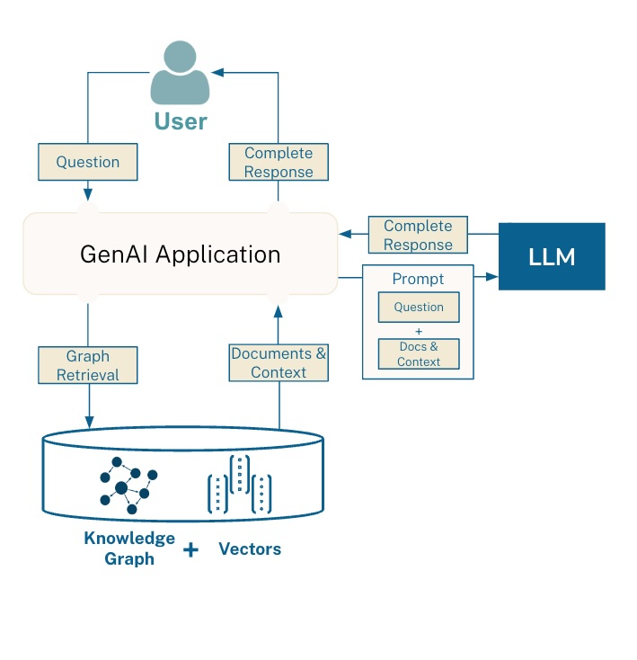

# Chat Service



This service uses the **GraphRAG** pattern to answer user questions. GraphRAG (Graph Retrieval-Augmented Generation) combines graph-based retrieval with generative AI to provide more accurate and context-aware responses.

**How GraphRAG Works:**
- User questions are received by the service.
- The system retrieves relevant information from a knowledge graph, which organizes data as interconnected entities and relationships.
- Retrieved context is passed to a language model, which generates a natural language answer using both the question and the graph-derived information.
- The response includes both the generated answer and the supporting retriever result from the knowledge graph.

This approach ensures that answers are grounded in structured knowledge, improving reliability and traceability.

This service provides a simple chat endpoint for user interactions. It is designed to handle chat messages and return responses, forming the backend for chat-based applications.

## Purpose

The Chat Service processes user messages and generates appropriate responses. It is intended to be used as a backend component for applications requiring chat functionality.

## Running with Docker

1. **Build the Docker image:**
    ```sh
    docker build -t chat-service .
    ```

2. **Run the container:**
    ```sh
    docker run -p 8000:8000 chat-service
    ```

    This will start the service on port `8000`.

## Running With python
1. **Create virtual env**
    ```sh
    python -m venv venv
    ```
2. **Activate virtual env**
    ```sh
    venv/Scripts/activate
    ```
3. **Install requirements**
    ```sh
    pip install -r requirements.txt
    ```
4. **Run main script**
  - Try:
      ```sh
      cd app
      python main.py
      ```
  - Or in chat-service dir:
      ```sh
      python -m app.main
      ```


## API Endpoint

### `POST /answer_question`

- **Description:** Accepts a question and an optional session ID, returning an answer and retriever result.
- **Request Body:**
  ```json
  {
     "query": "What are the main reasons for patient-physician discordance in SLE?",
     "session_id": "optional-session-id"
  }
  ```
- **Response:**
  ```json
  {
     "answer": "The capital of France is Paris.",
     "retriever_result": {...}
  }
  ```

- **Example cURL Call:**
  ```sh
  curl -X POST http://localhost:8000/answer_question \
     -H "Content-Type: application/json" \
     -d '{"query": "What is the capital of France?", "session_id": "optional-session-id"}'
  ```

- **Returns:** A JSON object containing the answer and retriever result.
